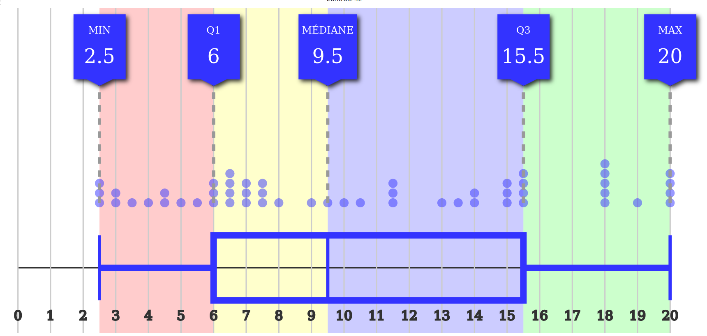

# markStat
display basic descriptive statistic of students marks

[demo](https://pi3141.github.io/markStat.html)

* self-contained html file, no internet connection required ;
* copy paste for Pronote (c)
* median and quartiles ;
* blue spot for each value ;
* boxplot ;
* can remember 3 distributions on local storage.

## Example

